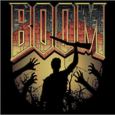

Boomstick
=========

### Success criteria

* We provide a VirtualBox image that anyone can download or
distribute on a memory stick for Clojure/ClojureScript/Datomic
training.
* (Lower priority) The same VirtualBox image works well for "beginner
night" Clojure meetups.
* We can easily keep the image up to date as components have new releases.
* Anyone in the company can build & release an update to the image.
* Our method for building the image can be adopted and extended by others.

Each piece of software should be integrated and ready-to-run. E.g., I should be able
to log in as the "dev" user and run lein with no further config or
setup. I should be able to start Eclipse and create a Clojure project
with no further config, etc.

### Usage

Run `./driver.sh` and STAND BACK.

Prepend `PACKER_LOG=1` to see Packer debug messages.

### Next steps

#### Softwares
    TODO: Add IntelliJ + Cursive.

#### Bonus
    TODO: LightTable
    TODO: Nightcode
    TODO: Heroku gem installed for quick-and-dirty deploys

#### Meta
    TODO: Drive this all from CI, triggered by Github commit notice.
    TODO: Relativize paths in `driver.sh`.
    TODO: Find way to DRY up username/password repetition.
    TODO: Find real place from which to serve editor binaries.
    TODO: Is there an ubuntu-desktop-minimal package?

